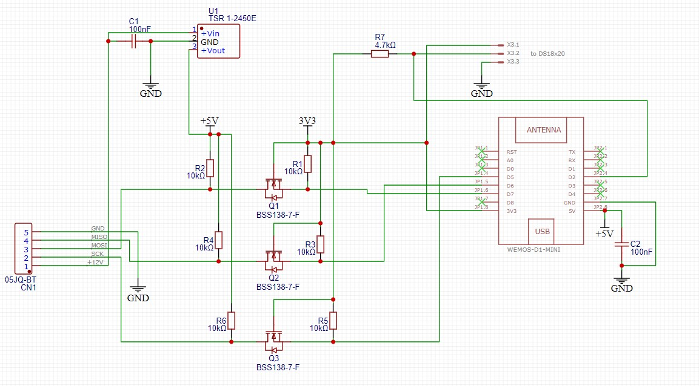
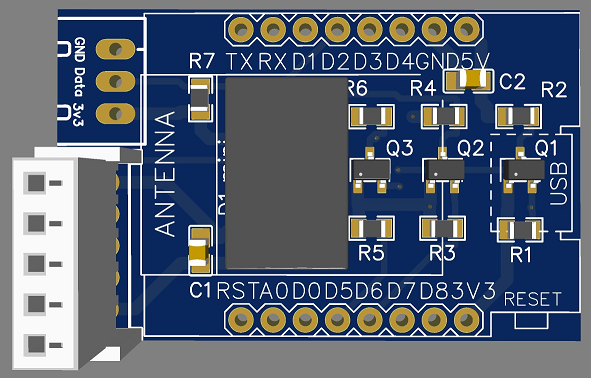
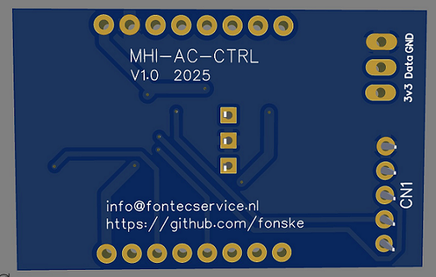

# Hardware

## Schematic

## PCB (Eagle)

You find the Gerber data and the BOM list and Pick and place list in the [PCB_order folder](PCB_order). The Gerber data is in [Gerber_MHI_AC_CTRL_WEMOS_SMD.zip](PCB_order/Gerber_MHI_AC_CTRL_WEMOS_SMD.zip). I used this Gerber data for the PCB order at [JLCPCB](https://jlcpcb.com).

## Bill of Material
Part |Value            |Package                    |comment
---- | ----            |----                       |-----
Q1, Q2, Q3,   |BSS138-7-F          |SMD                     |JLCPCB
C1, C2   |100nF             |SMD                     |JLCPCB
R1, R2, R3, R4, R5, R6  |10 kΩ  |SMD                     |JLCPCB
R7  |4.7 kΩ  |SMD                     |JLCPCB
U$1  |WEMOS-D1-MINI    |WEMOS-D1-MINI              |Order yourself
U1   |TSR_1-2450E       |TSR-1                      |Order yourself
CN1   |JST 05JQ-BT      |JST-XH-05-PACKAGE-LONG-PAD                     |Order yourself

Option for DS18B20:

Part |Value            |Package                    |comment
---- | ----            |----                       |-----
X3   |JST-XH-03        |JST-XH-03-PACKAGE-LONG-PAD |Order yourself

## Assembled PCB
The following photos show the assembled PCB (without R1 and X1, which are used in context of DS18x20 only).

# PCB (JLCPCB)
You can place an order at JLCPCB

## Connector
The AC provides the signals via the CNS connector. It has 5 pins with a pitch of 2.5 mm. It is out of the [XH series from JST]([https://nl.mouser.com/ProductDetail/JST-Commercial/05JQ-BTP](https://eu.mouser.com/ProductDetail/JST-Commercial/05JQ-BTP?qs=QpmGXVUTftFtpuyGEgLQzw%3D%3D).
I use [this](https://domoticx.net/webshop/connector-jst-xh-5p-254mm-pitch-male-female-lipo-4s-balance-22awg-20cm-silicone-welded/) 20 cm silicone cable with connectors to place the PCB to the front of the aircon for easy acces.

> [!WARNING]
> Opening of the indoor unit should be done by a qualified professional because faulty handling may cause leakage of water, electric shock or fire!
> Switch off the power supply of the complete Air conditioner, before connecting the PCB with a cable.
> Making a connection under power could cause the Wemos D1 Mini to be damaged!

## Power Supply
The JST connector provides +12V. The DC-DC converter [TSR 1-2450E](https://eu.mouser.com/ProductDetail/TRACO-Power/TSR-1-2450E?qs=vmHwEFxEFR%2FlQnbAtEoeVA%3D%3D)) converts the +12V to +5V.

## Signal Connection
The ESP8266 SPI signals SCL (SPI clock), MOSI (Master Out Slave In) and MISO (Master In Slave Out) are connected via a voltage level shifter 5V <-> 3.3V with the AC. Direct connection of the signals without a level shifter could damage your ESP8266!

## External Temperature Sensor
An external temperature sensor DS18x20 (e.g. DS18S20, DS18B20) is supported. If you want to connect a DS18x20 resistor R7 (4k7) is already on the PCB. The signals for the DS18x20 are available at X3.

## Hints for Assembly
If you prefer to assemble X1 on the top of the PCB because e.g. you want to place the MHI-AC-Ctrl outside of the AC, you have to consider the direction of CN1 as shown on the following photo.

## Order
If you want to order directly a SMD PCB assembly without: wemos d1 mini, TSR_1-2450E and JST 05JQ-BT connector, contact me at
alphonsuijtdehaag at gmail dot com
